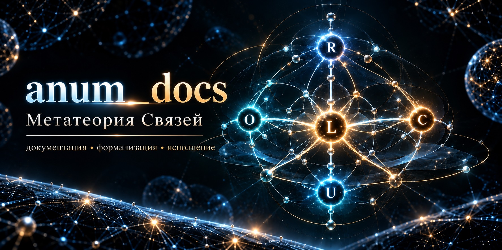

# Метатеория связей (МТС)
<!-- версия документа МТС; mts-doc-version: v0.14 -->
> **Версия МТС: v0.14**



**Метатеория связей (МТС)** — формальная система с одной первичной сущностью: **Связью (Link)**.

```text
всё есть Link
Link связывает Links
структура различается рекурсивно
```

## Основание v0.14

У `Link` есть две реляционно различимые полюсные позиции. Одна операция образования/канонизации `Link` даёт четыре возможных класса самоинцидентности:

```text
11
10
01
00
```

До ориентации:

```text
ROOT / {chiral pair} / PAIR
```

После локального выбора ориентации Context `K`:

```text
11 = ROOT
10 = START_K
01 = END_K
00 = PAIR
```

Рекурсивные коды:

```text
8 = ROOT
9 = START_K
6 = END_K
1 = PAIR
```

Это **рекурсивный алфавит МТС**, а не `Anum`/Q-алфавит и не обязательный набор `hardware` `opcode`.

## Контекстная ориентация

v0.14 отделяет объективную хиральность от локальной рамки:

```text
Ω = {W, J(W)}
W ≠ J(W)
J² = Id

Context K
  -> χ(K)
  -> START_K / END_K
```

`Observer`/`Context` не создаёт хиральность. Он выбирает локальную ориентацию внутри уже существующей Z2-структуры.

Для `Context` `A/B` относительный `transport`:

```text
g_AB ∈ {Id, J}
g_AA = Id
g_AB = g_BA
g_AB ∘ g_BC = g_AC
```

## Представления отделены от онтологии

```text
L0  Link ontology
L1  recursive structure: 8/9/6/1
L2  Anum / ExactSequence / Q / recursive codec
L3  STRING / UTF-8
L4  names / Dictionary / Grammar / Theory / FORMAL
```

Только `Link` является онтологической сущностью.

`Anum` — укоренённое компактное кодирование **последовательности `Links`**. `ExactSequence` сохраняет точную позиционную идентичность, которая не сводится к `fold-denotation`.

## Исполнение

`Generalized` `Modus` `Ponens` был установлен в v0.13 и сохранён v0.14:

```text
K ⟼ {A}
{A} ⟼ {B}
──────────
K ⟼ {B}
```

Один общий kernel покрывает `1→0`, `1→1`, `1→N`, `N→1`, `N→M`.

`A-memory` `execution` `profile` управляется отдельно от 14-`law` `contract` МТС и не превращает `backend` `scheduling`/`storage` в семантику.

<!-- мтс-текущая-проекция:начало -->
> **Текущий принятый выпуск МТС: v0.14.** Этот блок строится из принятых указателей командой `npm --prefix ts run docs:sync`.
>
> - Контракт: `mts-contract/v0.14` — [файл контракта](contracts/mts-contract-v0.14.json).
> - Корпус соответствия: `mts-conformance/v0.14` — [файл корпуса](contracts/mts-conformance-v0.14.json).
> - Свидетельство принятия: [файл принятия](cutover/typescript-c1-acceptance-v0.7.json).
<!-- мтс-текущая-проекция:конец -->

## Что принято в v0.14

Текущая поверхность включает 14 законов `V14-L1…V14-L14`, среди которых:

- одна `Link-`онтология и четыре возникающих `structural` `cases`;
- `context-relative` A4′ `orientation`;
- `immutable` `structural` `Link` `identity`;
- `Nat` с `N0=U`, отдельная шкала `Degree`;
- `Count`, `canonical` `Add`, `derived` `Le`;
- явная граница: `multiplication`/`full` `semiring` вне `acceptance` `scope`;
- сохранённый `generalized` `Modus` `Ponens`;
- `Anum` `sequence` `semantics` и явные `representation` `layers`.

Полный `normative` `registry`: [Система аксиом МТС](docs/theory/Система%20аксиом%20МТС.md).

## Полезные неподтверждённые идеи не выбрасываются

`Current` `docs` различают:

```text
accepted
derived/profile
research/deferred
historical alias
```

`DEFERRED != REJECTED`: идеи, для которых ещё нет достаточного `witness`, сохраняются в `canonical` `owner` как явно ненормативные `research` `lines` и в Git/`issue` `history`; они не удаляются только потому, что не входят в текущие 14 законов.

## Как читать документацию

- [Основания МТС](docs/theory/Основания%20МТС.md) — почему из Link возникает структура v0.14;
- [Система аксиом МТС](docs/theory/Система%20аксиом%20МТС.md) — 14 принятых законов и их классификация;
- [Ачисла и сериализация](docs/specs/Ачисла%20и%20сериализация.md) — `Anum`/`ExactSequence`/Q/`STRING`;
- [Формальная нотация МТС](docs/specs/Формальная%20нотация%20МТС.md) — `Dictionary`/`Grammar`/`Theory`/`FORMAL`;
- [Апамять и управление сетью связей](docs/specs/Апамять%20и%20управление%20сетью%20связей.md) — `execution`/`profile`/`substrate` и `retained` `research`;
- [Пучки связей](docs/specs/Пучки%20связей.md) — производная bundle-поверхность;
- [Словарь терминов МТС](docs/Словарь%20терминов%20МТС.md) — `current`/`profile`/`research`/`historical` `terminology`.

## Источники истины

При конфликте используйте:

```text
accepted contract / conformance / traceability
        ↓
requirements owner registry
        ↓
current human documentation
        ↓
implementation notes
```

GitHub — источник текущего состояния проекта; `immutable` `acceptance` `artifacts` сохраняют границы принятых версий.

## Обозреватель контрактов
<a id="mts-readme-contract-observatory"></a>
<!-- мтс:требование:README-OBSERVATORY:начало -->
[Открыть Обозреватель контрактов](https://netkeep80.github.io/anum_docs/) — Производная визуализация принятых машинных свидетельств только для чтения; она не является смысловым авторитетом.
<!-- мтс:требование:README-OBSERVATORY:конец -->

## Разработка

Правила изменения репозитория: [CONTRIBUTING](docs/CONTRIBUTING.md).

Ключевая дисциплина:

```text
new semantic claim
-> explicit issue / scope
-> falsifier / executable witness
-> contract / traceability
-> one documentation owner
-> independent readiness
-> author acceptance
```

## Авторы и соавторы
<a id="mts-readme-authors"></a>
<!-- мтс:требование:README-AUTHORS:начало -->
- [Вертушкин Роман Павлович](https://github.com/netkeep80)
- [Дьяченко Константин Константинович](https://github.com/konard)
- [Шакиров Тимур Эдуардович](https://github.com/TimaxLacs)
- [Бурдуков Александр Николаевич](https://github.com/InAiwetrustAGI)
- [Глазунов Иван Сергеевич](https://github.com/ivansglazunov)
<!-- мтс:требование:README-AUTHORS:конец -->
